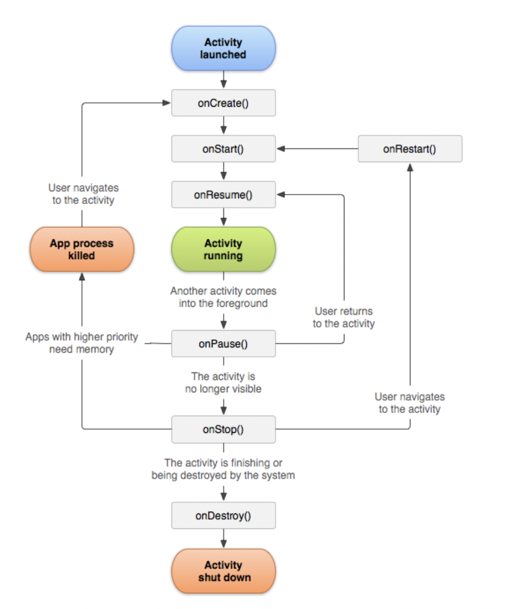
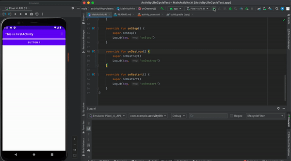
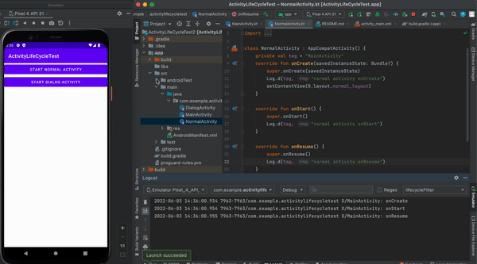
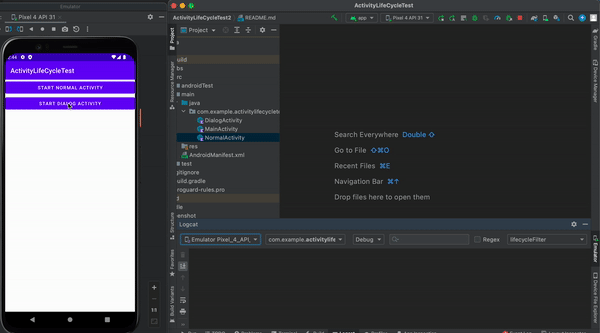
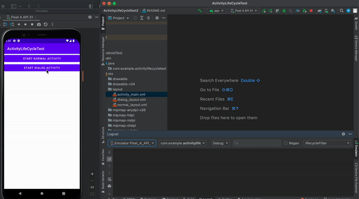
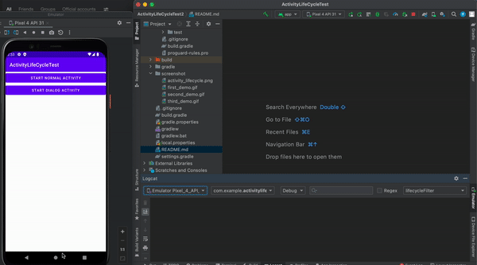

## DISCLAIMER
`ONLY FOR STUDY`

## 学习来源 
- 郭霖老师的 [《第一行代码：android 第三版》](https://e.jd.com/30712694.html)

#安卓的生命周期流程图 Android lifecycle

# Android Activity

- onCreate 
  - activity第一次被创建的时候才会被回掉，比如说 第一次打开这个activity，或者这个activity被销毁了重新打开
    
- onStart
  - activity从不可见到可见的时候被调用， 比如说 使用一个intent从activity A 到 activity B 变化的期间会调用这个回调
    
- onResume
  - 当activity已经准备好可以和用户交互的时候， 并且这个activity一定是在back stack中也就是栈的顶端
    
- onPause
  - 当我们准备去启用或者恢复另外一个activity，比如说一个open 一个dialog，通常这个时候我们会去释放一些暂时没用的cpu资源。比如说，暂停在这个activity但是暂停时还会消耗电池续航的资源。重要的一点是这些处理一定要快
    
- onStop
  - 当前的activity已经完全不可见的时候会调用此回调。 如果你只是开启一个dialog 只是失去焦点我们只会回掉调onpause 但是 如果我们是开启新的activity 然后完全覆盖这就会回调到onstop了.我们可以在onstop使用将当前的资料存入数据库
    
- onDestory
  - 当前的activity被销毁
    
- onRestart
  - 在activity从停止的状态变成运行状态的时候调用
  
# 例子 Demo

- 我们正常运行的时候我们可以看见 运行的生命周期是从 onCreate -> onStart -> onResume)
   
   
- 当我们开启新的activity的时候, 我们可以看见顺序是 activity A 先onPause -> 然后等activity B的页面完全创建(onCreate -> onStart -> onResume) -> activity A onStop
   
   
- 当我们从activity B 回到 activity A, 它的顺序是activity B先onPause -> activtyA(onRestart -> onStart -> onResume) -> activity B onStop -> onDestroy
   
   
- 当我们开启dialog的时候, 可以看见我们的activity A 的的状态是进入onPause,当dialog取消了之后我们的状态就变成onResume
   
   
- 当我们返回主页面的时候
  